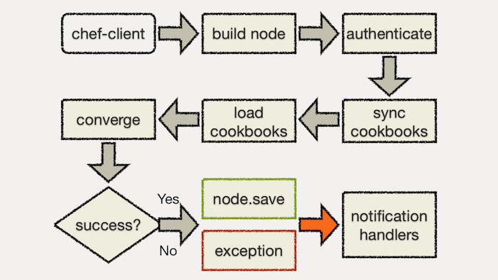

# Anatomy of a Chef Run

Anatomy of a Chef Run

# Anatomy of a Chef Run
## Steps

* Build the node
* Synchronize cookbooks
* Compile resource collection
* Configure the node
* Run notification handlers

# Anatomy of a Chef Run
## Build the Node

Before anything else happens, the system is profiled with Ohai.

Ohai gathers all information it can about the system including OS, Hardware, etc...

Ohai can be expanded upon with ohai plugins to gather specific attributes not found by default, such as, specific application information for an in-house application.

These attributes gathered by Ohai are stored in the node object in _Chef-Server_.

# Anatomy of a Chef Run
## Node Objects

After the client has authenticated with the Server, Chef retrieves the node object from the server.

Node objects represent a set of data called attributes and a list of
configuration to apply called a run list.

# Anatomy of a Chef Run
## Node Object

Nodes have attributes at varying priority levels (automatic, default, normal, override).

Nodes have a run list.

Nodes have an environment.

# Anatomy of a Chef Run
## Node Object: JSON

    @@@javascript
    {
      "name": "www1.example.com",
      "json_class": "Chef::Node",
      "chef_type": "node",
      "chef_environment": "_default",
      "automatic": { ... },
      "default": { ... },
      "normal": { ... },
      "override": { ... },
      "run_list": [ "role[this]", "recipe[or::that]" ]
    }

# Anatomy of a Chef Run
## Node Run List

The run list can contain recipes and roles. Roles can contain recipes and also other roles.

Chef expands the node's run list down to the recipes. The roles and recipes get set to node attributes.

# Anatomy of a Chef Run

# Anatomy of a Chef Run
## Synchronize Cookbooks

Chef downloads from the Chef Server all the cookbooks that appear as
recipes in the node's expanded run list.

Chef also downloads all cookbooks that are listed as dependencies
which might not appear in the run list.

If the node's `chef_environment` specifies cookbook versions, the Chef
downloads the version specified. Otherwise the latest available
version is downloaded.

# Anatomy of a Chef Run
## Chef Run

This starts when you see:

    INFO: Starting Chef Run for NODE_NAME

The run context is created with the node and the cookbook collection.

# Anatomy of a Chef Run

# Anatomy of a Chef Run
## Node Convergence

Convergence is when the configuration management system brings the
node into compliance with policy.

In other words, the node is configured based on the roles and recipes
in its run list.

Convergence in Chef happens in two phases.

* Compile
* Execute

# Anatomy of a Chef Run
## Convergence: Compile

Chef recipes are written in Ruby. During the compile phase, the Chef
Recipe DSL is processed for Chef *Resources* to be configured.

During the processing of recipes:

* Ruby code is executed directly
* Recognized resources are added to the *Resource Collection*

For example:

    @@@ruby
    pkg = "apache2"

    package pkg do
      action :install
    end

# Anatomy of a Chef Run
## Convergence: Execute

Chef walks the Resource Collection in order.

* Chef runs the specified actions for each resource
* Providers know how to perform the actions

# Anatomy of a Chef Run

# Anatomy of a Chef Run

# Anatomy of a Chef Run

# Anatomy of a Chef Run

# Anatomy of a Chef Run
## Report and Exception Handlers

At the end of the Chef Run, report and exception handlers are triggered.

* Report handlers run when Chef exits cleanly
* Exception handlers run when Chef exits abnormally with an unhandled exception.

# Anatomy of a Chef Run
## Report Handlers

Normal, clean exit:

    INFO: Chef Run complete in 42.72288 seconds
    INFO: Running report handlers
    INFO: Report handlers complete

# Anatomy of a Chef Run
## Exception Handlers

Abnormal exit from unhandled exception:

    ^CFATAL: SIGINT received, stopping
    FATAL: SIGINT received, stopping
    ERROR: Running exception handlers
    ERROR: Exception handlers complete

# Anatomy of a Chef Run

# Anatomy of a Chef Run
## Additional Resources

* http://wiki.opscode.com/display/chef/Anatomy+of+a+Chef+Run
* http://wiki.opscode.com/display/chef/Authentication
* http://wiki.opscode.com/display/chef/Chef+Client
* http://wiki.opscode.com/display/chef/Nodes
* http://wiki.opscode.com/display/chef/Attributes
* http://wiki.opscode.com/display/chef/Evaluate+and+Run+Resources+at+Compile+Time
