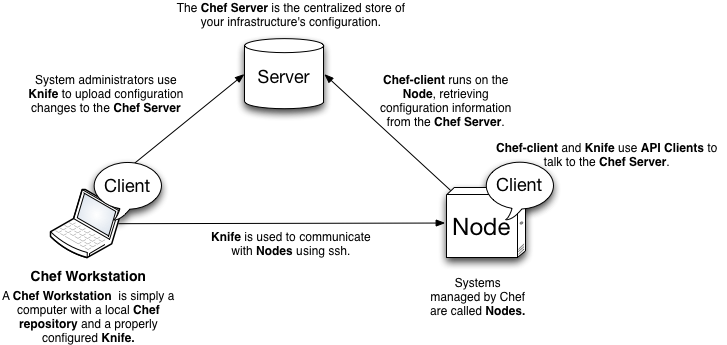

# Architectural Overview

An Architectural Overview of Chef

 
</img>

# Architectural Overview
## Components
Chef as an architecture consists of three main components:

* chef-server
* nodes
* workstations

# Architectural Overview
## Chef-Server

<B>Chef-Server is:</b>

* The central store of configuration data
* Contains cookbooks, roles, environments, data bags, client and node data
* Rest API makes data accessible to _nodes_ and _clients_

# Architectural Overview
## Nodes
Nodes are any system configured by chef-client.

To Chef-Server, nodes are little more than a run-list composed of cookbooks, recipes, and attributes.

# Architectural Overview
## Workstations
A workstation is a system utilized to create and manage cookbooks and other configuration data.

Contains two key components:

* Knife
* Repository of configuration documents (cookbooks, roles, environments, etc...)
