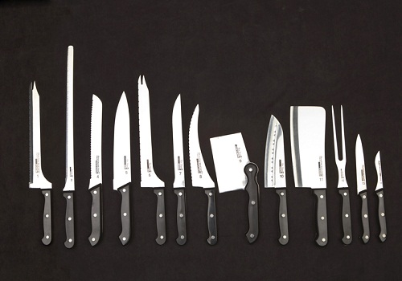

# Knife

Knife

# Knife
Knife is a command-line tool that comes with Chef.

It is used by administrators, primarily on the Chef Workstation, to mange nodes, chef-server, and chef objects.

# Knife
## Sub-Commands
Knife comes pre-packaged with several sub-commands, for this overview, we'll focus on the following:

* Bootstrap
* Cookbook
* Data Bag
* Environment
* Node
* Role
* SSH

# Knife
## Plugins

In addition to the built-in command-set, you have the ability to
load plugins that you or someone else wrote.

Some community plugins are indexed at:
http://wiki.opscode.com/display/chef/Community+Plugins

If you would like to take a stab (pun intended) at writing your
own plugins, see:
http://wiki.opscode.com/display/chef/Knife+Plugins

# Knife
## Bootstrap

knife bootstrap is used to bootstrap new nodes that were just
built and have not seen the light of Chef yet.

Bootstrap templates exist in your local knife configuration directory
and can be tailored to a number of different factors.

The most common method is to have a template per OS/OS Version.

Once a node has been configured to talk on the network, you can
utilize `knife bootstrap` to do your post configuration for you.
It will establish SSH connectivity and proceed with what is defined
in the template specified.

# Knife
## Cookbook

The `knife cookbook` command is typically used to upload
cookbooks to the Chef Server after modification, or a new
cookbook has been created.

You can also use `knife cookbook` to show the available versions,
download cookbok(s) from the Chef Server, or delete cookbooks
from the Chef Server.

# Knife
## Data Bag

The `knife data bag` command interacts with the Chef Server to upload,
download, create and delete data bag objects.

# Knife
## Environment

The `knife environment` command is used to list, edit, delete and
show details about the environments stored on the Chef Server.

_DANGER: In the ExactTarget organization, you should *NEVER* edit
a Chef Environment directly on the Chef Server.  This *WILL*
cause the environment files stored in the repository to become
out of sync._

# Knife
## Node

The `knife node` command is one of the most useful knife commands,
allowing us to interact with the Chef Server and list nodes, manage
the node attributes, as well as view the node attributes and
configuration data.

# Knife
## Role

The `knife role` command gives us the ability to list roles on the
Chef-Server, show details about the stored attributes in a particular
role, and edit or delete a role on the Chef Server.

_DANGER: In the ExactTarget organization, you should *NEVER* edit
a role directly on the Chef Server.  This *WILL* cause the role files
stored in the repository to become out of sync._

# Knife
## SSH

The `knife ssh` command is used to interact with node objects and
execute commands on them.  Primarily we use this command to run
_chef-client_. You can do some really impressive trickery with this
command, like passing a script via STDIN to _shef_ (yes, that's an s)
to load a single cookbook to run _chef-client_ against.
